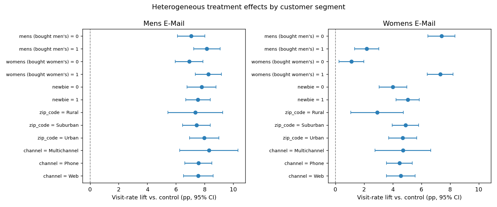

# When Average Effects Lie
### Turning a routine email A/B test into a targeting strategy with causal + uplift modelling

[](https://github.com/yougijain/When-Average-Effects-Lie/actions/workflows/tests.yml)

[](LICENSE)

**[→ Read the interactive write-up](https://yougijain.github.io/When-Average-Effects-Lie/)**
 · [Generated results](RESULTS.md) · [The analysis script](hillstrom_ab_analysis.py) · [Changelog](CHANGELOG.md)

**The business question:** A retailer runs two promotional emails — one featuring
men's merchandise, one featuring women's. Both "work" on average. So which
customers should actually receive which email next quarter — and who should we
stop emailing entirely?

The naive answer ("both lift sales, send both to everyone") leaves money on the
table. This project shows why, using the
[Hillstrom MineThatData email experiment](https://blog.minethatdata.com/2008/03/minethatdata-e-mail-analytics-and-data.html):
a real randomized trial of **64,000 customers** split across a Men's-email arm, a
Women's-email arm, and a no-email control.

---

## TL;DR — the finding

> **The Women's email's healthy +4.5pp average lift is an illusion of aggregation.**
> It moves website visits **+7.3pp** for customers who have bought women's
> merchandise before, but only **+1.1pp** for those who haven't, and just
> **+2.2pp** for men's-merchandise buyers. The Men's email, by contrast, lifts
> *everyone* by ~7.7pp fairly uniformly.

So the two campaigns need opposite playbooks:

| Campaign | Avg. visit lift | Heterogeneity | Recommended policy |
|---|---|---|---|
| **Men's email** | **+7.66pp** `[+7.00, +8.32]` | low (interactions n.s. after FDR) | **Contact broadly.** Gain from targeting `-$2.47 [-$9.97, +$5.23]`, indistinguishable from zero |
| **Women's email** | **+4.52pp** `[+3.89, +5.16]` | **high** (T×affinity p < 1e-4) | **Target the ~59%** with real affinity. **+\$16.95 net value per 1,000** `[+$2.99, +$30.60]`, sending **415 fewer contacts** |

Under illustrative economics ($2 / incremental visit, $0.06 / contact ⇒ 3pp
break-even), targeting the Women's send returns **\$33.85 vs \$16.90 per 1,000**
blanket. That is a gain of **+\$16.95**, 95% bootstrap interval
`[+$2.99, +$30.60]`, clear of zero in 99.4% of resamples. The qualitative call
holds across a wide range of those prices.

Taken at face value, the average keeps the Women's email going to the 41% of
the list it doesn't move. That segment's realized lift is +0.95pp against a
3.0pp break-even.



---

## How it's built — 8 layers

The single script [`hillstrom_ab_analysis.py`](hillstrom_ab_analysis.py) runs the
whole pipeline and writes [`RESULTS.md`](RESULTS.md) plus eleven figures. Every
number is computed from the data — nothing is hard-coded.

| # | Layer | What it does | Why it's in the pipeline |
|---|---|---|---|
| 1 | **Load & validate** | shape, missingness, arm sizes, base rates | nothing downstream is trusted before the file is |
| 2 | **Randomization checks** | covariate balance (SMD love plot), omnibus assignment test | the causal claims are earned rather than assumed (max \|SMD\| = 0.009, omnibus p = 0.76) |
| 3 | **Average treatment effect** | diff-in-proportions + Wald CIs; bootstrap for spend | the textbook A/B answer, and the one that turns out to mislead |
| 4 | **Regression adjustment** | Lin (2013) interacted estimator, HC1 robust SE | tightens the CI without moving the point estimate; its stability re-confirms randomization |
| 5 | **Heterogeneous effects** | subgroup CATEs + treatment×covariate interactions | **the twist** — where the average lies |
| 6 | **Uplift modelling** | T-learner vs S-learner chosen by cross-fitted Qini, Qini curve / coefficient, uplift@k, decile calibration | individual-level treatment effects rather than averages, from a model chosen without spending the reporting split |
| 7 | **Targeting policy value** | IPW policy value, cost-sensitive break-even threshold, bootstrap intervals on every dollar figure | converts the model into a decision with a dollar figure, and says how sure that figure is |
| 8 | **Robustness & inference** | randomization inference, Benjamini-Hochberg FDR, retrospective power | the headline should not depend on one distributional assumption or one lucky split |

### Figures produced
`01_balance_love_plot` · `02_ate_forest` · `03_hte_forest` ·
`04_qini_mens` / `04_qini_womens` · `05_policy_mens` / `05_policy_womens` ·
`06_calibration_mens` / `06_calibration_womens` ·
`07_uncertainty_mens` / `07_uncertainty_womens`

---

## Run it

```bash
python -m venv .venv
# Windows:        .venv\Scripts\activate
# macOS / Linux:  source .venv/bin/activate
pip install -r requirements.txt
python hillstrom_ab_analysis.py
```

The script auto-downloads the dataset (~4 MB) to `data/` on first run and caches
it, falling back to a gzipped mirror where the canonical host is blocked, and
refusing to cache anything that isn't the published experiment: required
columns, 64,000 rows and the three arm sizes are all checked first. Full run is
well under a minute. Open `RESULTS.md` for the headline numbers
and `figures/` for the charts.

### Tests

```bash
pip install -r requirements-dev.txt
pytest tests/
```

The tests run on synthetic data and never touch the network. They cover the
machinery whose failures wouldn't show up as a crash: the Qini coefficient
(does it reward the true ranking over a null of random ones, is it really
invariant to monotone rescaling, the property that makes the calibration check
necessary, and how does it break ties), the download validator, and learner
selection.

`requirements.txt` is pinned to the exact versions the committed `RESULTS.md`
and figures were produced with, and needs Python 3.12 or newer. Under those pins
the whole pipeline reproduces the committed outputs byte for byte, figures
included. Layers 1–5 also reproduce to the last digit under any compatible
stack; Layer 6's gradient-boosted models are the one place numbers have been
seen to move between environments, which is what the pins are for. An earlier
run whose uplift numbers no longer reproduce is written up in
[`CHANGELOG.md`](CHANGELOG.md).

### The write-up site
`index.html` is a single self-contained page: no build step, no JavaScript, no
CDN calls. `social-card.png` is the 1280x640 Open Graph image it and the repo
share; `python tools/make_social_card.py` regenerates it, reading its figures
out of `RESULTS.md` so the card cannot drift away from the analysis. Its only assets are the committed figures in `figures/` and two
self-hosted font files in `fonts/` (Source Serif 4, SIL Open Font License).
Open it locally by double-clicking it, or read the
[hosted version](https://yougijain.github.io/When-Average-Effects-Lie/).

---

## A few methodology choices worth defending

- **Primary outcome = `visit`.** Highest base rate (~14.7%), so the most
  statistical power. `conversion` (~0.9%) and `spend` are reported too, but the
  decision rests on the well-powered metric.
- **T-learner *and* S-learner, chosen off the reporting split.** Both are
  reported, and the choice between them is made by 5-fold cross-fitted Qini on
  the training portion, every row scored by models that never saw it, so the
  reporting split is never asked both to pick the maximum of two candidates and
  to say how good that maximum is. (Men's: T-learner, Qini 2.6, little to
  rank. Women's: S-learner, Qini 60.4, lots to rank.) The huge gap in Qini
  *is* the heterogeneity story in one number.
- **Every dollar figure carries an interval.** The reporting split is one
  14,900-row draw, so the policy numbers are resampled 2,000 times with the
  fitted scores held fixed. That is what turns "Men's targeting loses \$2.47"
  into the honest "`[-$9.97, +$5.23]`, this split cannot tell". It is also why
  the Men's Qini of 2.6 is reported as `[-23.1, +29.3]`. That interval covers
  zero, so the ranker is indistinguishable from none at all.
- **Calibration, not just ranking.** Qini is invariant to any monotone
  transform of the score, so it certifies the ranking and says nothing about
  the magnitudes. The targeting rule spends the magnitudes, comparing each
  predicted uplift to a 3pp break-even. Deciles of predicted uplift are plotted
  against observed: Women's comes in at slope 0.74 (on scale, somewhat
  over-spread), Men's at 0.07 (no magnitude signal at all, which is the flat
  Qini curve restated in units).
- **IPW policy value.** Because treatment was randomized, the propensity is a
  known constant, so the inverse-propensity policy-value estimator is unbiased,
  with no outcome model required to score the policy. The cut is set at the
  cost/value break-even, the economically correct threshold (not just uplift > 0).
- **Multiple testing.** Every subgroup interaction is reported with a
  Benjamini-Hochberg FDR correction; only the two Women's-email interactions
  survive, so the headline isn't a fishing-expedition artifact.
- **Randomization inference.** A 2,000-permutation exact test backstops the
  parametric p-values for the primary effect (permutation p = 0.0000).

## Honest limitations
- **Quote the difference, not the multiple.** The point estimates put targeted
  net value at 2.0× blanket, but the blanket figure's own interval is
  `[-$4.92, +$39.15]` and covers zero, which leaves the ratio unbounded. "Adds
  \$17 per 1,000" is supported; "doubles net value" is not.
- The dollar figures in Layer 7 are **illustrative assumptions**, not Hillstrom's
  real margins; they exist to demonstrate cost-sensitive targeting. The
  *qualitative* recommendation is robust to the exact prices.
- Uplift models are fit on 65% of each two-arm subset and scored on the held-out
  35%. Neither the learner choice nor the threshold is tuned on that 35%: the
  first is cross-fitted on the training portion, the second fixed at the
  economic break-even. What remains is that one split supplies the Qini, the
  calibration and the dollar figures; three reads on one sample move together,
  and separating them needs another sample rather than another estimator.
- The bootstrap intervals hold the fitted scores fixed, so they cover sampling
  variation in the reporting split **given this model**, not variation in the
  modelling procedure. Covering that would mean refitting inside every
  resample, training split included, which is a different and much more
  expensive claim than the one being made.
- The decile the targeting rule cuts through is also the worst-calibrated one:
  mean predicted uplift 3.7pp against an observed −1.6pp [−4.8, +1.5]. Roughly
  1,500 customers in the held-out split are contacted who probably shouldn't
  be. That is the standing cost of a fixed break-even threshold, which lands
  where the predictions are noisiest. It still beats moving the cut to wherever
  this split happens to peak.
- Layer 7's net-value figures are computed on that 35% held-out split, where the
  realized lift runs a little under the full-sample ATE (~3.8pp vs +4.52pp for
  Women's, ~7.0pp vs +7.66pp for Men's). That is sampling noise, not a
  contradiction, and it is why blanket net value (\$16.90 / 1,000 for Women's)
  doesn't reproduce if you multiply the headline ATE by \$2.
- "Affinity" here is proxied by past-purchase flags already in the data. The
  models already use every column Hillstrom records (recency, spend history
  and its segment, channel, zip type, tenure), so there is no unused feature
  left to add; purchase *frequency* simply isn't in the file. Sharpening the
  policy means features from outside this dataset, not better use of it.

---

*Dataset: Kevin Hillstrom, MineThatData E-Mail Analytics and Data Mining
Challenge (2008). Public domain. Code released under the [MIT License](LICENSE).*
